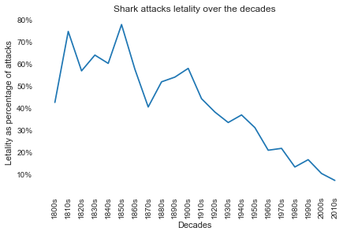
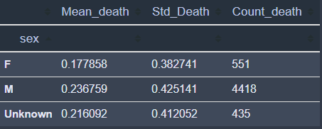
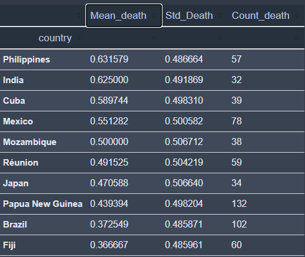
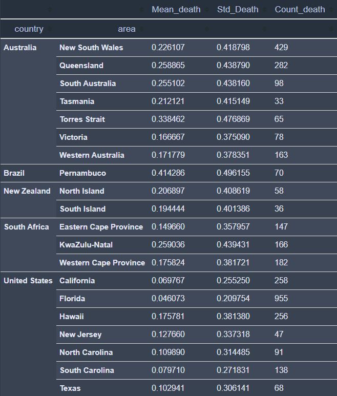
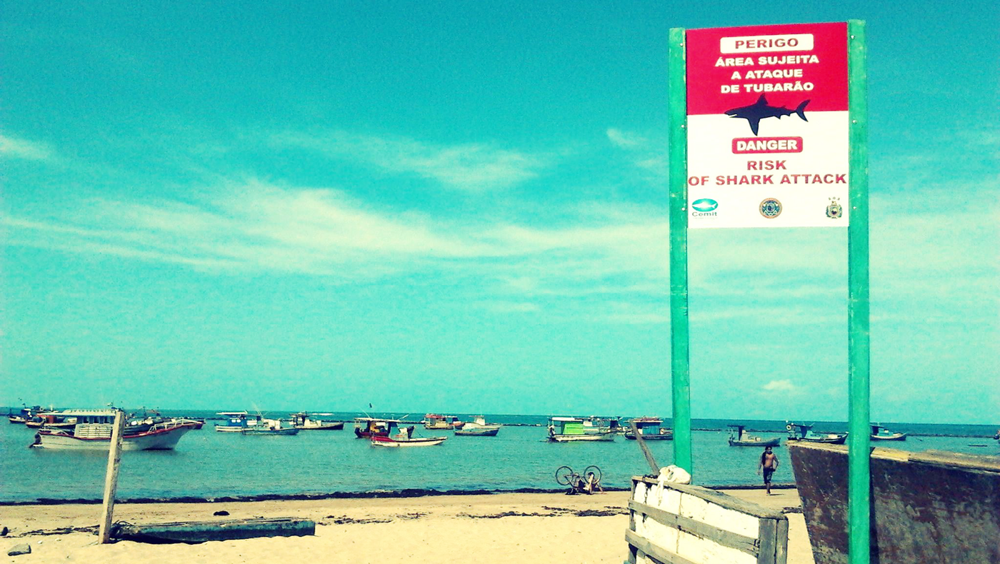

# Assessing shark attacks across the globe :shark: :skull: :globe_with_meridians: 

:file_folder: Kaggle's Global Shark Attack (https://www.kaggle.com/teajay/global-shark-attacks/)

Repository includes: 
* Final jupyter notebook containing some interesting insights from the parsed dataset
* Final parsed dataset

## Main insights derived from the adjusted dataset:
### Are sharks becoming less deadly over the years? :angel:


As we can see from the chart above, **letality rate has sharply dropped over the last 50 years and one may assume that shark attacks are becoming less deadly.**

Few caveats to this assumption:
> 1. More non-fatal shark attack incidents are being recorded now, which increases the fatality rate denominator and imply a lower ratio

### Are men more prone to die when attacked by sharks? :surfing_man:

* Table below indicates that men have higher letality rate when compared to women (c.23.6% vs. 17.8%)
* A two-sample t-test should indicate whether men's letality rate is statiscally different from women's



* T-test result:
```python
Ttest_indResult(statistic=3.0991587518744077, pvalue=0.0019515630735905507)
```

As we can see from the cell above, **p-value is signficantly lower than 5% and infers that men are more prone to die by a shark attack.**

Few caveats to this assumption:

>* There is a huge discrepancy when comparing the Ns of both populations (4418 vs 551)

>* Men could be more prone to perform radical sports on the water, such as surfing, which might impact their chance of survival given a shark attack

### What are the most letal shark-attacking regions of the world? :skull_and_crossbones:


* Table below indicates countries (with N = 30 or higher )with highest letality rates:



As we can see from the table above, **there are 4 countries (Philippines, India, Cuba and Mexico - excluding countries with less than 30 incidents)** with a high incidence of death from a shark attack when compared to chance (c. 50%)

Few caveats to this assumption:
> 1. All above-mentioned countries have low Ns, which might imply that their healthcare systems are  not well-equipped to handling shark attacks (when compared to high N countries such as Australia and the US)

**Digging deeper now, focusing on countries' subregions...:**



Finally, as we can see from the table above, **Pernambuco in Brazil appears to be the most dangerous shark-attacking** (with N>30 over the observed horizon - 1800-2018) region in the world (c. 41% deadly incidence).

Few **interesting insights** from this assessment:
> 1. High N regions in the US, such as Florida and California, have relatively lower fatality rate when compared to other regions' across the globe with similar Ns
> 2. Australia has a wide range of fatality rate across its states - ranging from 17% in Victoria to 34% in Torres Straits
> 3. New Zealand has very similar fatality rates over its two main islands



## Data parsing: what was done? :scissors:

* Non-relevant columns from the original dataset were removed
* Month column added, corresponding to the month of the incident
* Country column were adjusted according to Pycountry data
* Other minor columns added: fatality (boolean) and decade (eg.: 1980s)

